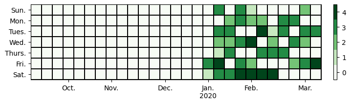

# Habit Trackers

An automation experiment influenced after reading James Clear's book [Atomic Habits](https://jamesclear.com/atomic-habits), who mentions the following [three benefits of habit tracking](https://jamesclear.com/habit-tracker):

- reminds you to act
- motivates you to continue
- provides immediate satisfaction

## Exercise

Data is aggregated from various sources to [Strava](https://www.strava.com/) then pushed to Google Sheets using IFTTT. Heat map automatically updated here daily using a GitHub Action.  Duration gradients are based on 15 minute intervals.

